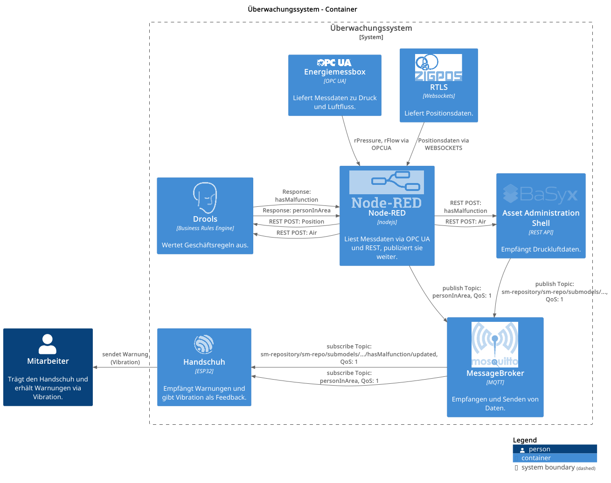
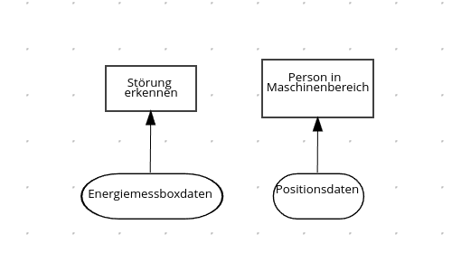

# IIoT Gefahrenbereich-Warnsystem

## Übersicht

Diese Applikation wurde für das IIoT Testbed der HTWD Dresden entwickelt, um Mitarbeitende vor Gefahrenbereichen zu warnen. Das System überwacht Druckluftversorgungssysteme und erkennt Störungen wie Druckabfälle. Wenn ein Mitarbeiter einen Bereich mit einer technischen Störung betritt, erhält dieser eine Warnung über einen speziellen Handschuh mit Vibrationsfeedback.

Excact task specified in [task.md](task.md).

## Architektur

### Systemkomponenten

- **Energiemessbox**: Erfasst Messdaten zu Druck und Luftfluss via OPC UA
- **ZIGPOS**: Liefert Positionsdaten der Mitarbeiter
- **Node-RED**: Liest Messdaten aus verschiedenen Quellen und verarbeitet sie
- **Drools**: Business Rules Engine zur Auswertung von Geschäftsregeln
- **Asset Administration Shell (AAS)**: Modelliert das Druckluftsystem als Asset
- **MQTT Message Broker**: Ermöglicht die Kommunikation zwischen den Komponenten
- **Handschuh**: IoT-Gerät, das Warnungen empfängt und Vibrationsfeedback gibt

### Systemdiagramm

Das Systemdiagramm ist im PlantUML-Format unter `system_diagram.puml` verfügbar und visualisiert die Interaktion der verschiedenen Komponenten.

### DMN Diagramm
Das DMN Diagramm beschreibt die Geschäftsregeln. In dem Fall wann eine Warnung an den MD5 Stick geschickt werden soll.

### Technische Details

1. OPC-UA zur Abfrage der Druckluftversorgungsdaten
2. MQTT für die lose Kopplung der Systemkomponenten
3. AAS (Asset Administration Shell) für die Modellierung des Druckluftsystems
4. Node-RED für die Low-Code Entwicklung
5. Drools als Business Rule Management System

## Getting Started

1. Starten Sie den MQTT Broker
2. Stellen Sie die Verbindung zur Energiemessbox über OPC UA her
3. Konfigurieren Sie die ZIGPOS-Verbindung für Positionsdaten
4. Importieren Sie die Node-RED Flows
5. Starten Sie die Drools-Engine mit den konfigurierten Geschäftsregeln
6. Verbinden Sie den Handschuh mit dem MQTT Broker
