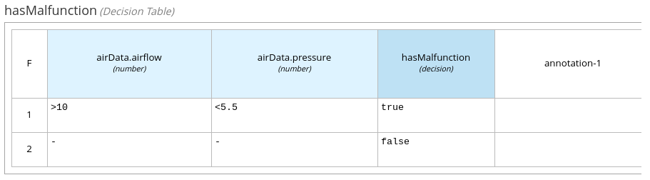

== Architekturkonzept und Schnittstellen

=== Systemüberblick

Das IIoT Gefahrenbereich-Warnsystem dient dem Schutz von Mitarbeitern in der Fertigungsumgebung des IIoT Testbeds der HTWD Dresden. Das System erkennt Gefahrenbereiche, die durch technische Störungen entstehen, und warnt Mitarbeiter über einen tragbaren Handschuh mit Vibrationsfeedback.

Das Hauptszenario ist die Erkennung eines Druckabfalls in der Druckluftversorgung, der eine potenzielle Gefahr darstellt. Wenn ein Mitarbeiter einen solchen Gefahrenbereich betritt, erhält er eine Warnung.

=== Systemarchitektur

Die Systemarchitektur folgt einem Container-basierten Ansatz mit microservice-orientierten Komponenten, die über standardisierte Protokolle kommunizieren.

.Systemdiagramm
image::docs/system_diagram.png[System Diagramm,800]

==== Hauptkomponenten

[cols="1,3,2"]
|===
|Komponente |Beschreibung |Technologie

|Energiemessbox
|Erfasst Messdaten zu Druck und Luftfluss
|OPC UA

|ZIGPOS RTLS
|Liefert Positionsdaten der Mitarbeiter
|WebSockets

|Node-RED
|Zentraler Datenintegrations- und -verarbeitungsservice
|Node.js

|Drools
|Business Rules Engine zur Auswertung von Geschäftsregeln
|Java, Quarkus

|Asset Administration Shell (AAS)
|Modelliert das Druckluftsystem als Asset nach Industrie 4.0 Standards
|BaSyx Framework

|MQTT Message Broker
|Ermöglicht die asynchrone Kommunikation zwischen Komponenten
|Eclipse Mosquitto

|Handschuh
|IoT-Gerät, das Warnungen empfängt und Vibrationsfeedback gibt
|ESP32
|===

=== Datenfluss und Schnittstellen

==== OPC UA Schnittstelle zur Energiemessbox

Die Energiemessbox stellt Druckluftdaten über das OPC UA Protokoll bereit. Node-RED ruft die Daten alle 50 Millisekunden ab. Folgende Variablen werden abgefragt:

* `rPressure`: Aktueller Druck in Bar (NodeId: ns=2;s=|var|CECC-LK.Application.GVL.rPressure)
* `rFlow`: Aktueller Luftstrom in Bar (NodeId: ns=2;s=|var|CECC-LK.Application.GVL.rFlow)

==== WebSocket-Schnittstelle zum ZIGPOS System

Das ZIGPOS Real-Time-Location-System (RTLS) sendet Positionsdaten über eine WebSocket-Verbindung. Der Ablauf ist:

1. Authentifizierung über REST API, um einen API-Schlüssel zu erhalten (gültig für 60 Minuten)
2. Aufbau einer WebSocket-Verbindung mit dem API-Schlüssel
3. Empfang von Positionsdaten über das Topic "POSITIONS"
4. Filterung der Daten nach dem Tag "Martin Schmidt"

==== REST-Schnittstelle zu Drools

Node-RED sendet zwei Arten von Daten an die Drools Rules Engine:

1. *Druckluftdaten*: Druck und Durchfluss für die Erkennung von Störungen
2. *Positionsdaten*: Koordinaten des Mitarbeiters für die Erkennung, ob sich die Person im Gefahrenbereich befindet

Drools antwortet mit:
* `hasMalfunction`: Boolean-Wert, der angibt, ob eine Störung erkannt wurde
* `personInArea`: Boolean-Wert, der angibt, ob sich die Person im Gefahrenbereich befindet

==== REST-Schnittstelle zur Asset Administration Shell (AAS)

Node-RED sendet folgende Daten an die AAS:
1. Aktuelle Druckluftdaten aus der Energiemessbox
2. Ergebnis der Störungserkennung von Drools (`hasMalfunction`)

Die AAS veröffentlicht Änderungen automatisch auf dem MQTT Broker.

==== MQTT-Schnittstelle zum Handschuh

Der MQTT Broker dient als zentrale Kommunikationsplattform. Der Handschuh abonniert zwei Topics:

1. `sm-repository/sm-repo/submodels/.../hasMalfunction/updated` (QoS 1): Information über erkannte Störungen
2. `personInArea` (QoS 2): Information darüber, ob sich die Person im Gefahrenbereich befindet

=== Geschäftsregeln

Die Geschäftsregeln werden in Drools durch DMN-Diagramme (Decision Model and Notation) definiert.

.DMN Übersicht
image::docs/dmn_overview.png[DMN Übersicht,600]

==== Störungserkennung

Eine Störung wird erkannt, wenn:
* Der Luftstrom größer als 10 Bar ist UND
* Der Druck kleiner als 5,5 Bar ist

.DMN Störungserkennung

==== Erkennung von Personen im Gefahrenbereich

Die Erkennung, ob sich eine Person im Gefahrenbereich befindet, erfolgt anhand der Position.

.DMN Personenerkennung im Bereich
image::docs/dmn_person_bereich.png[DMN Personenerkennung,600]